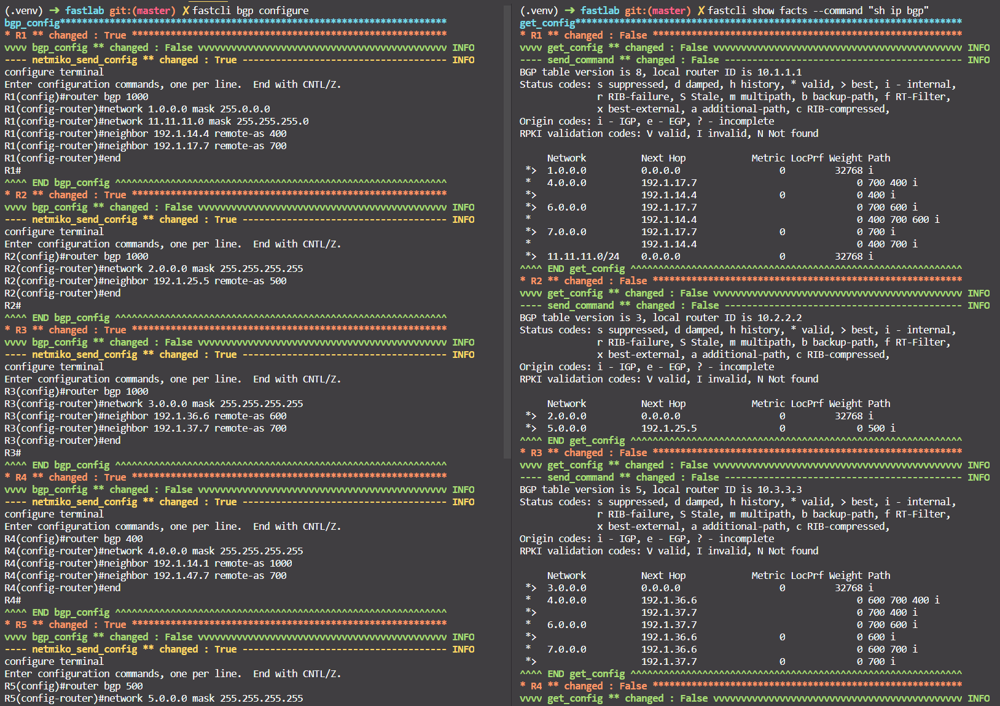

# Fastcli - A tool for network configuration - Nornir 3.0

This public repo contains python codes of a CLI tool, called `fastcli`, for automatically generation of configuration commands and send these commands to the network. The current version supports the commands for interfaces configuration, OSPF, EIGRP, RIP and BGP configurations. 

The environment is pre-configured for setting the BGP configuration of topology 1, under `inventory/bgp` folder.
You can change the topology to be configured by change the variable in the `constants.py` file.

```python
config_file = "inventory/bgp/config.yaml"
```

A zip file `EVE-NG-topologies.zip` that contains 2 network topologies for testing purpose is attached.

The `inventory/bgp` folder contains the following files described the desired state of the network, including:
- config.yaml
- defaults.yaml
- groups.yaml
- hosts.yaml

The workflow is:
- Defined the configuration information in `hosts.yaml`, including:
  - List of interfaces and IP addresses of each device
  - OSPF, BGP, EIGRP information
- Run the configuration command `fastcli interfaces configure`, or `fastcli bgp configure`.
- Commands will be automatically generated and sent to each device.
- Confirm the configuration with `fastcli show facts --command "sh ip int br"`, 
or `fastcli show facts --command "sh ip bgp"`.

## Some commands supported
| fastcli commands                           	| Usage                                                                                                                	|
|--------------------------------------------	|----------------------------------------------------------------------------------------------------------------------	|
| fastcli interfaces configure               	| configure the Interfaces of all the devices, can be filtered with --device, --group                                  	|
| fastcli show facts --command "any command" 	| show facts with a given command, can be filtered with --device, --group, show <br> structured data with --structured 	|
| fastcli ospf configure --ospf_area 0       	| configure OSPF routing of all the OSPF routers, can configure each area with: --ospf_area                            	|
| fastcli ospf stub --ospf_area 0            	| configure an OSPF area as stub area                                                                                  	|
| fastcli ospf nssa --ospf_area 0            	| configure an OSPF area as Not-So-Stubby-Area                                                                         	|
| fastcli bgp eigrp configure                	| configure EIGRP routing of all the EIGRP routers                                                                     	|
| fastcli rip configure                      	| configure RIP routing of all the RIP routers                                                                         	|
| fastcli bgp configure                      	| configure BGP routing of all the BGP routers                                                                         	|
## Requirements

To use this code you will need:

- Python 3.8+
- A network with SSH connection setup of all devices.

## Install and Setup
Clone the code to local machine.
```bash
git clone https://github.com/kimdoanh89/fastcli
cd fastcli
```

Setup Python Virtual Environment (requires Python 3.8+)
```bash
python3.8 -m venv venv
source venv/bin/activate
pip install --editable .
```

The variable `config_file` in `constants.py` file needs to be configured before running depends on where you
keep your config file.

## Example topologies

### Topology 1: BGP configuration


Configuration files under `inventory/bgp` folder.

Steps:
- Check the config_file variable in `constants.py`
  ```python
  config_file = "inventory/bgp/config.yaml"
  ```
- Check the paths of `host_file`, `group_file`, `defaults_file` in `config.yaml`.
- Define configurations in `inventory/bgp/hosts.yaml` depends on new topology.
- Configure interfaces: `fastcli interfaces configure`.
- Check the interfaces configuration with `fastcli show facts --command "sh ip int br"`.


- Configure BGP with `fastcli bgp configure`.
- Check with `fastcli show facts --command "sh ip bgp" --group bgp`



### Topology 2: OSPF-EIGRP-RIP configuration

Configuration files under `inventory/ospf-eigrp-rip`


Configuration files under `inventory/bgp` folder.

Steps:
- Check the config_file variable in `constants.py`
  ```python
  config_file = "inventory/ospf-eigrp-rip/config.yaml"
  ```
- Check the paths of `host_file`, `group_file`, `defaults_file` in `config.yaml`.
- Change configurations in `inventory/ospf-eigrp-rip/hosts.yaml` depends on new topology.
- Configure interfaces: `fastcli interfaces configure`.
- Check the interfaces configuration with `fastcli show facts --command "sh ip int br"`.


- Configure OSPF with `fastcli ospf configure`.
- Check with `fastcli show facts --command "sh run | s router ospf" --group ospf`


- Configure EIGRP with `fastcli eigrp configure`.
- Check with `fastcli show facts --command "sh run | s router eigrp" --group eigrp`


- Configure RIP with `fastcli rip configure`.
- Check with `fastcli show facts --command "sh run | s router rip" --group rip`


