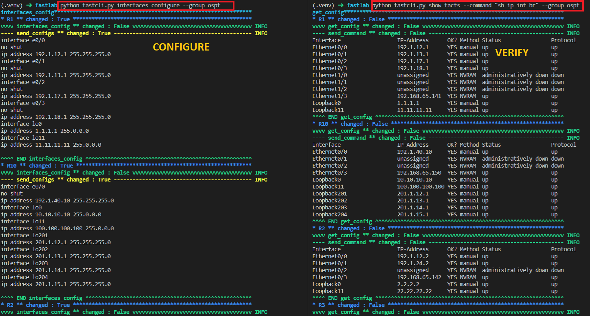
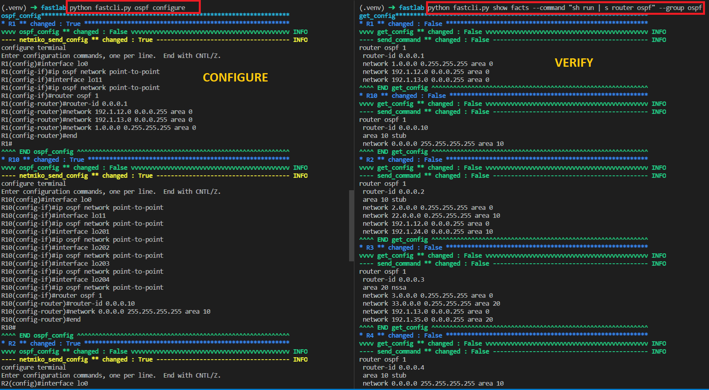
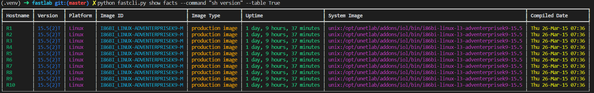

# Nornir-3.0 - Network Automation Fast Configuration (NAFC)

## Requirements

To use this code you will need:

- Python 3.8+

## Install and Setup
Clone the code to local machine.
```bash
git clone https://github.com/kimdoanh89/fastcli
cd fastcli
```

Setup Python Virtual Environment (requires Python 3.8+)
```bash
python3.8 -m venv venv
source venv/bin/activate
pip3 install -r requirements.txt
```

The environment `NORNIR_CONFIG_FILE` needs to be configured before running depends on where you
keep your config file:
```bash
export NORNIR_CONFIG_FILE=inventory/ospf-eigrp-rip/config.yaml
```
**NOTE - IMPORTANT**: Need to change the paths of `host_file`, `group_file`, `defaults_file`
 in `config.yaml` file to your own paths - NEED TO FIX THIS.

Some configuration files are under `inventory/ospf-eigrp-rip` folder.
- defaults.yaml
- groups.yaml
- hosts.yaml

Changes the `hosts.yaml` depending on your network topology.

## Some commands supported
| fastcli commands                                     	| Usage                                                                                                                 	|
|------------------------------------------------------	|-----------------------------------------------------------------------------------------------------------------------	|
| python fastcli.py interfaces configure               	| configure the Interfaces of all the devices, can be <br>  filtered with the keywords: --device, --group               	|
| python fastcli.py show facts --command "any command" 	| show facts with a given command, can be filtered with <br>  --device, --group, show structured data with --structured 	|
| python fastcli.py ospf configure --ospf_area 0       	| configure OSPF routing of all the OSPF routers, can <br>  configure each area with keyword: --ospf_area               	|
| python fastcli.py ospf stub --ospf_area 0            	| configure an OSPF area as stub area                                                                                   	|
| python fastcli.py ospf nssa --ospf_area 0            	| configure an OSPF area as Not-So-Stubby-Area                                                                          	|
| python fastcli.py eigrp configure                    	| configure EIGRP routing of all the EIGRP routers                                                                      	|
| python fastcli.py rip configure                      	| configure RIP routing of all the RIP routers                                                                          	|

## Output

### Configure interfaces



### Configure ospf



### Collect facts and present in a table
**NOTE**: This table formatting currently works only for `sh version` command.



## Example Topologies

### Topology 1: OSPF-EIGRP-RIP

Configuration files under `inventory/ospf-eigrp-rip`


### Topology 2: BGP

Configuration files under `inventory/bgp`

Steps:
- Copy folder `inventory/ospf-eigrp-rip`, change name to `inventory/bgp`.
- Change environment variable `export NORNIR_CONFIG_FILE=inventory/bgp/config.yaml`.
- Change the paths of `host_file`, `group_file`, `defaults_file` in `config.yaml`.
- Change configurations in `inventory/bgp/hosts.yaml` depends on new topology.
- Configure interfaces: `python fastcli.py interfaces configure` for all devices; or for each device
with `python fastcli.py interfaces configure --device R1`.
- Check the interfaces configuration with `python fastcli.py show facts --command "sh ip int br"`.
- Configure BGP with `python fastcli.py bgp configure`.
- Check with `python fastcli.py show facts --command "sh ip bgp" --group bgp`

