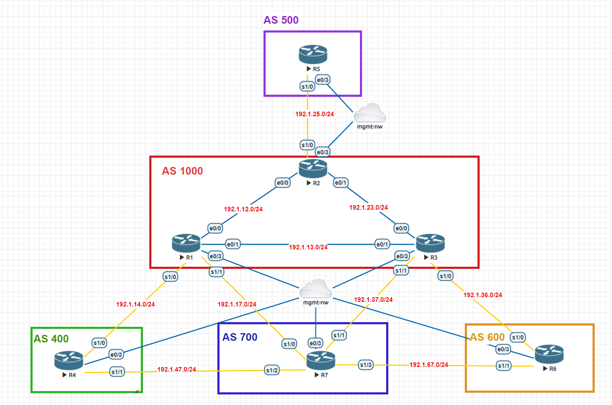
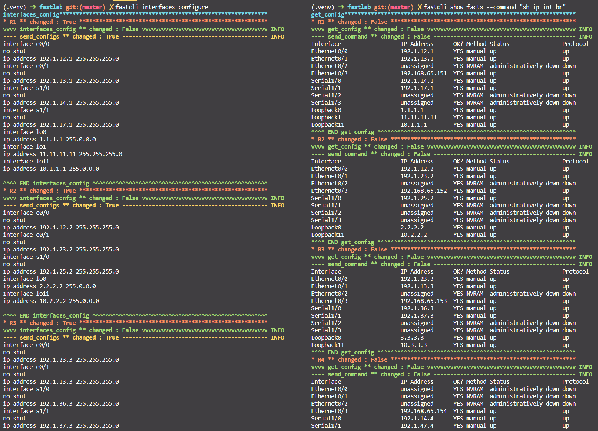
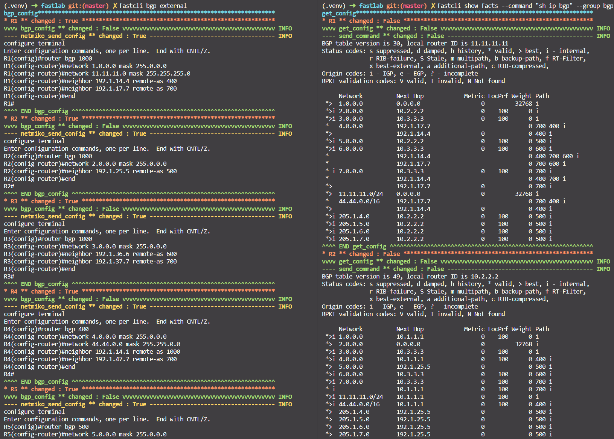
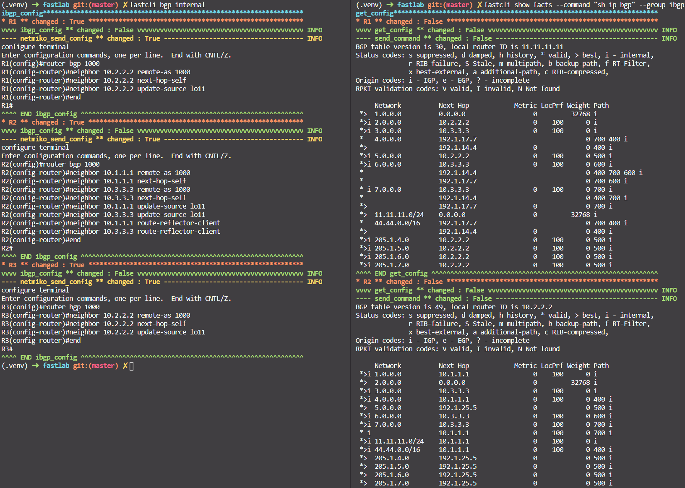
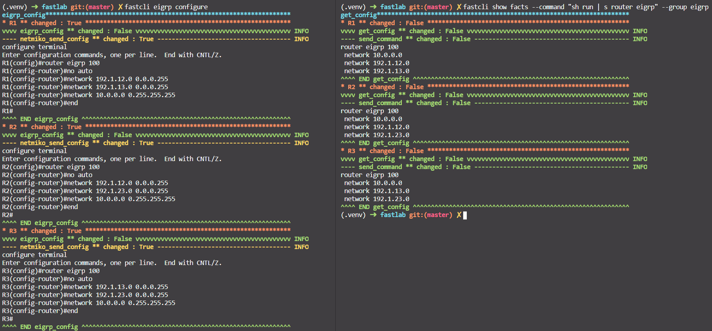
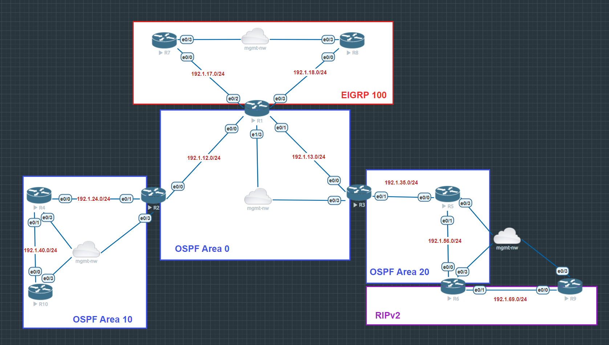
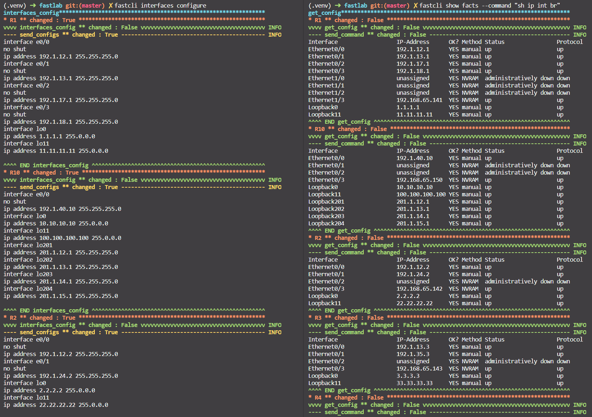
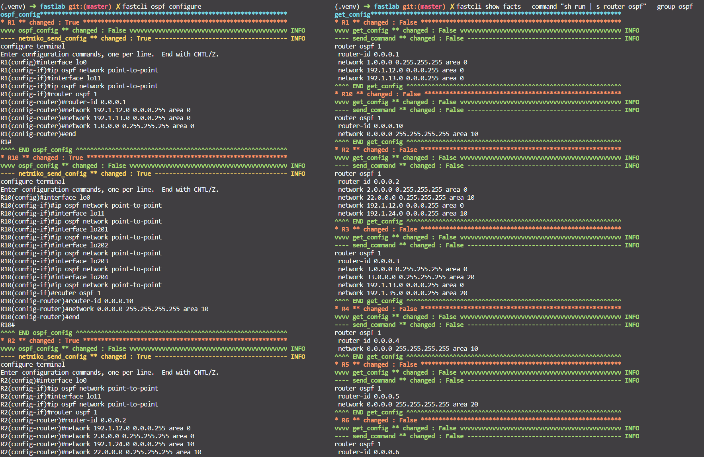
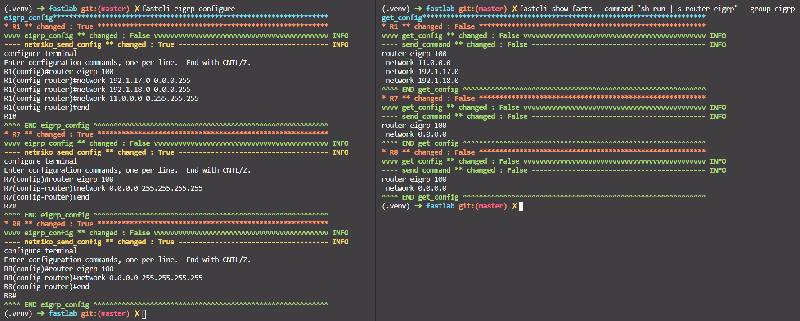
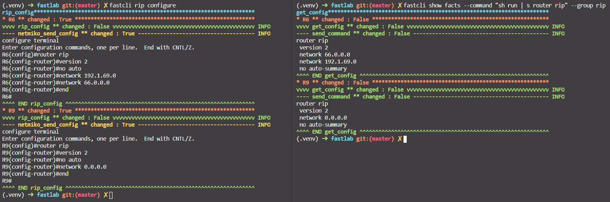

# Fastcli - A tool for network configuration - Nornir 3.0

[](https://developer.cisco.com/codeexchange/github/repo/kimdoanh89/fastcli)

This public repo contains python codes of a CLI tool, called `fastcli`, for automatically generation of configuration commands and send these commands to the network. The current version supports the commands for interfaces configuration, OSPF, EIGRP, RIP and BGP configurations. 

The environment is pre-configured for setting the BGP configuration of topology 1, under `inventory/bgp` folder.
You can change the topology to be configured by change the variable in the `constants.py` file.

```python
config_file = "inventory/bgp/config.yaml"
```

A zip file `EVE-NG-topologies.zip` that contains 2 network topologies for testing purpose is attached.

### Initializing Nornir and Inventory
The `inventory/bgp` folder contains the following files described the desired state of the network, including:
- config.yaml
- defaults.yaml
- groups.yaml
- hosts.yaml

There is the tutorial from Nornir website that we need to understand about [initializing Nornir](https://nornir.readthedocs.io/en/latest/tutorial/initializing_nornir.html), [inventory](https://nornir.readthedocs.io/en/latest/tutorial/inventory.html).

#### groups.yaml
```yaml
---
###### Routing Groups ######
eigrp:
  data:
    routing: eigrp
ospf:
  data:
    routing: ospf
rip:
  data:
    routing: rip
bgp:
  data:
    routing: bgp
ibgp:
  data:
    routing: ibgp
###### Platform Groups ######
ios:
  platform: ios
  connection_options:
    netmiko:
      platform: cisco_ios
      extras: {}
    napalm:
      extras:
        optional_args: {}

nxos:
  platform: nxos
  connection_options:
    netmiko:
      platform: cisco_nxos
      extras: {}
    napalm:
      port: 8443
      extras:
        optional_args: {}

xr:
  platform: xr
  connection_options:
    netmiko:
      platform: cisco_xr
      extras: {}
    napalm:
      port: 8443
      extras:
        optional_args: {}
```

#### hosts.yaml
Example of hosts.yaml file for Topology 1: BGP and EIGRP configuration
```yaml
---
R1:
    hostname: 192.168.65.151
    groups:
        - bgp
        - ibgp
        - eigrp
    data:
        # interfaces: {name: interface ip address, ...}
        interfaces: {"e0/0": "192.1.12.1/24", "e0/1": "192.1.13.1/24",
                     "s1/0": "192.1.14.1/24", "s1/1": "192.1.17.1/24",
                     "lo0": "1.1.1.1/8", "lo1": "11.11.11.11/24",
                     "lo11": "10.1.1.1/24"}
        asn: 1000
        bgp_advertised: ['1.0.0.0/8', "11.11.11.0/24"]
        # bgp_neighbors: {"remote-as": ["list of remote AS's ip address"], ...}
        bgp_neighbors: {"400": ["192.1.14.4"], "700": ["192.1.17.7"]}
        # ibgp_neighbors: {"remote-as": ["list of remote AS's ip address"], ...}
        ibgp_neighbors: {"1000": ["10.2.2.2"]}
        # ibgp_update_source: {"update_source": ["list of remote AS's ip address"], ...}
        ibgp_update_source: {"lo11": ["10.2.2.2"]}
        eigrp_advertised: {"100": ["192.1.12.0/24", "192.1.13.0/24", "10.0.0.0/8"]}

R2:
    hostname: 192.168.65.152
    groups:
        - bgp
        - ibgp
        - eigrp
    data:
        interfaces: {"e0/0": "192.1.12.2/24", "e0/1": "192.1.23.2/24",
                     "s1/0": "192.1.25.2/24",
                     "lo0": "2.2.2.2/8", "lo11": "10.2.2.2/24"}
        asn: 1000
        bgp_advertised: ['2.0.0.0/8']
        # bgp_neighbors: {"remote-as": ["list of remote AS's ip address"], ...}
        bgp_neighbors: {"500": ["192.1.25.5"]}
        # ibgp_neighbors: {"remote-as": ["list of remote AS's ip address"], ...}
        ibgp_neighbors: {"1000": ["10.1.1.1", "10.3.3.3"]}
        # ibgp_update_source: {"update_source": ["list of remote AS's ip address"], ...}
        ibgp_update_source: {"lo11": ["10.1.1.1", "10.3.3.3"]}
        eigrp_advertised: {"100": ["192.1.12.0/24", "192.1.23.0/24", "10.0.0.0/8"]}
        route_relector_clients: ["10.1.1.1", "10.3.3.3"]
```

The workflow is:
- Defined the configuration information in `hosts.yaml`, including:
  - List of interfaces and IP addresses of each device
  - OSPF, BGP, EIGRP information
- Run the configuration command `fastcli interfaces configure`, or `fastcli bgp configure`.
- Commands will be automatically generated and sent to each device.
- Confirm the configuration with `fastcli show facts --command "sh ip int br"`, 
or `fastcli show facts --command "sh ip bgp"`.

## Some commands supported
| fastcli commands                           	| Usage                                                                                                                	|
|--------------------------------------------	|----------------------------------------------------------------------------------------------------------------------	|
| fastcli interfaces configure               	| configure the Interfaces of all the devices, can be filtered with --device, --group                                  	|
| fastcli show facts --command "any command" 	| show facts with a given command, can be filtered with --device, --group, show <br> structured data with --structured 	|
| fastcli ospf configure --ospf_area 0       	| configure OSPF routing of all the OSPF routers, can configure each area with: --ospf_area                            	|
| fastcli ospf stub --ospf_area 0            	| configure an OSPF area as stub area                                                                                  	|
| fastcli ospf nssa --ospf_area 0            	| configure an OSPF area as Not-So-Stubby-Area                                                                         	|
| fastcli bgp eigrp configure                	| configure EIGRP routing of all the EIGRP routers                                                                     	|
| fastcli rip configure                      	| configure RIP routing of all the RIP routers                                                                         	|
| fastcli bgp configure                      	| configure BGP routing of all the BGP routers                                                                         	|


Currently, it supports the following commands:
```bash
fastcli
Usage: fastcli [OPTIONS] COMMAND [ARGS]...

  CLI tool for fast configuration of the network, powerd by Nornir 3.0.

Options:
  --help  Show this message and exit.

Commands:
  bgp         Command for BGP configuration
  eigrp       Command for EIGRP configuration
  interfaces  Command for interfaces configuration
  ospf        Commands for OSPF configuration
  rip         Command for RIP configuration
  show        Get information from all devices [], filtered by name or group
```

And for each command, it supports some subcommands, for example, `ospf` command:
```bash
fastcli ospf
Usage: fastcli ospf [OPTIONS] COMMAND [ARGS]...

  Commands for OSPF configuration

Options:
  --help  Show this message and exit.

Commands:
  configure  Configure OSPF from the information defined in hosts.yaml
  nssa       Configure an OSPF area as Not-So-Stubby-Area
  stub       Configure an OSPF area as stub area
```

You can access the help of each subcommand to know about the arguments using `fastcli {command} {subcommand} --help`, for example:

```bash
fastcli ospf configure --help
Usage: fastcli ospf configure [OPTIONS]

  Configure OSPF from the information defined in hosts.yaml

Options:
  --device TEXT  Configure only the device
  --group TEXT   Configure all devices belong to the group  [default: ospf]
  --help         Show this message and exit.
```


## Requirements

To use this code you will need:

- Python 3.8+
- A network with SSH connection setup of all devices.

Ubuntu packages:
```bash
sudo apt install sqlite3
```

## Install and Setup
Clone the code to local machine.
```bash
git clone https://github.com/kimdoanh89/fastcli
cd fastcli
```

Setup Python Virtual Environment (requires Python 3.8+)
```bash
python3.8 -m venv venv
source venv/bin/activate
pip install -r requirements.txt
pip install --editable .
```

The variable `config_file` in `constants.py` file needs to be configured before running depends on where you
keep your config file.

## Example topologies

### Topology 1: BGP configuration



Configuration files under `inventory/bgp` folder.

Steps:
- Check the config_file variable in `constants.py`
  ```python
  config_file = "inventory/bgp/config.yaml"
  ```
- Check the paths of `host_file`, `group_file`, `defaults_file` in `config.yaml`.
- Define configurations in `inventory/bgp/hosts.yaml` depends on new topology.
- Configure interfaces: `fastcli interfaces configure`.
- Check the interfaces configuration with `fastcli show facts --command "sh ip int br"`.




- Configure eBGP with `fastcli bgp external`.
- Check with `fastcli show facts --command "sh ip bgp" --group bgp`



- Configure iBGP with `fastcli bgp internal`.
- Check with `fastcli show facts --command "sh ip bgp" --group ibgp`



- Configure EIGRP with `fastcli eigrp configure`.
- Check with `fastcli show facts --command "sh run | s router eigrp" --group eigrp`




### Topology 2: OSPF-EIGRP-RIP configuration



Configuration files under `inventory/ospf-eigrp-rip` folder.

Steps:
- Check the config_file variable in `constants.py`
  ```python
  config_file = "inventory/ospf-eigrp-rip/config.yaml"
  ```
- Check the paths of `host_file`, `group_file`, `defaults_file` in `config.yaml`.
- Change configurations in `inventory/ospf-eigrp-rip/hosts.yaml` depends on new topology.
- Configure interfaces: `fastcli interfaces configure`.
- Check the interfaces configuration with `fastcli show facts --command "sh ip int br"`.



- Configure OSPF with `fastcli ospf configure`.
- Check with `fastcli show facts --command "sh run | s router ospf" --group ospf`



- Configure EIGRP with `fastcli eigrp configure`.
- Check with `fastcli show facts --command "sh run | s router eigrp" --group eigrp`



- Configure RIP with `fastcli rip configure`.
- Check with `fastcli show facts --command "sh run | s router rip" --group rip`



## Testing pyATS
Create testbed.yaml

```bash
```

Capture Golden Config
```bash
pyats learn config --testbed-file inventory/bgp/testbed.yaml --output inventory/bgp/output/golden-config
```

Learn interface, ospf, bgp

```bash
pyats learn ospf bgp interface --testbed-file inventory/bgp/testbed.yaml --output inventory/bgp/output
```